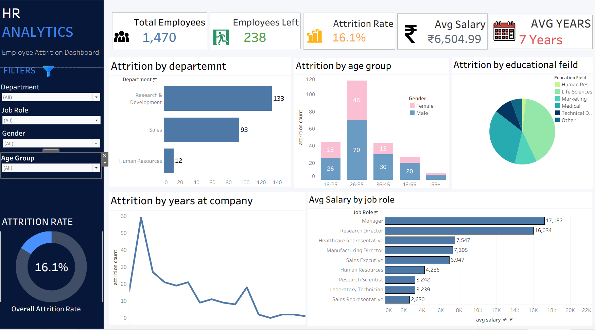
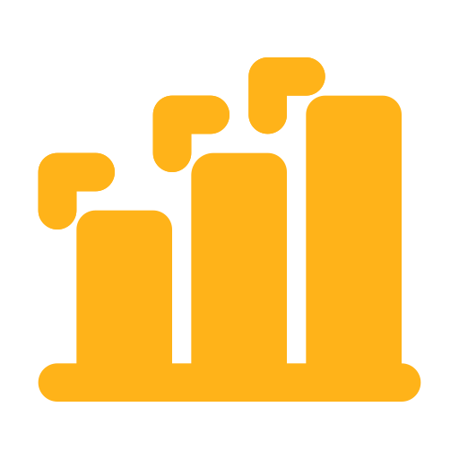

📊 HR Analytics Dashboard
📌 Project Overview

This HR Analytics Dashboard provides insights into employee attrition, workforce demographics, salary distribution, and employee retention trends. The dashboard helps HR professionals and business leaders identify key factors contributing to employee turnover and make data-driven workforce decisions.

Built using Tableau, the dashboard offers interactive filters and visualizations for deeper analysis of employee data.

🎯 Objectives

Analyze overall employee attrition rate.

Identify departments with the highest employee turnover.

Understand attrition trends across different age groups.

Examine employee educational backgrounds.

Analyze average salary across job roles.

Track attrition based on years spent at the company.

Enable interactive workforce analysis using dynamic filters.

📈 Key Performance Indicators (KPIs)

KPI	Value

Total Employees	1,470

Employees Left	238

Attrition Rate	16.1%

Average Salary	₹6,504.99

Average Years at Company	7 Years

📊 Dashboard Components
1. Attrition by Department

Displays employee attrition across departments:

Research & Development

Sales

Human Resources

Insight: Research & Development experiences the highest attrition.

2. Attrition by Age Group

Shows employee attrition across age categories:

18–25

26–35

36–45

46–55

55+

Gender-wise comparison is included for deeper analysis.

3. Attrition by Educational Field

Visualizes employee attrition based on educational backgrounds:

Human Resources

Life Sciences

Marketing

Medical

Technical Degree

Other

4. Attrition by Years at Company

Line chart illustrating employee turnover based on tenure.

Purpose: Identify stages where employees are most likely to leave.

5. Average Salary by Job Role

Compares salary distribution among different job roles:

Manager

Research Director

Healthcare Representative

Manufacturing Director

Sales Executive

Human Resources

Research Scientist

Laboratory Technician

Sales Representative

🎛 Interactive Filters

Users can dynamically filter dashboard insights using:

Department

Job Role

Gender

Age Group

🛠 Tools & Technologies

Tableau Desktop

Microsoft Excel

Data Visualization

Dashboard Design

Data Analytics

🔍 Key Insights

Overall employee attrition rate is 16.1%.

Research & Development department records the highest employee turnover.

Employees aged 26–35 years show the highest attrition.

Attrition is concentrated among employees with lower tenure.

Significant salary variation exists across job roles.

📂 Dataset

The dataset contains employee information including:

Employee Count

Department

Job Role

Gender

Age

Education Field

Salary

Years at Company

Attrition Status

🚀 Skills Demonstrated
Data Cleaning

Data Visualization

HR Analytics

Dashboard Development

KPI Design

Interactive Filtering

Business Intelligence

Storytelling with Data
📷 Dashboard Preview

images& logo
"Certain materials, including logos and images, 
are included in this educational data analytics 
dashboard under the fair use provision of the Indian Copyright Act, 1957. 
These materials are used strictly for educational, non-commercial purposes. 
All copyrights and trademarks remain the property of their respective owners."

 
 

  
  
 

 above logo and images are taken from     ------     https://www.flaticon.com/

 
👤 Author

Anuja Deshmukh
Aspiring Data Analyst | Tableau | Power BI | Excel | SQL | Python